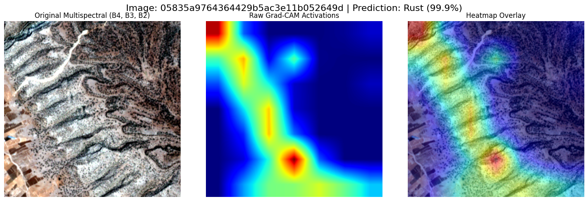

# AI-For-Agriculture-2026-Kaggle-Competition

## Multispectral Crop disease detection using sentinel datasets: An Engineering journey from foundation models to Pure CNNs.

This repository contains the complete machine learning pipeline engineered for the ICPR Kaggle competition to classify crop diseases(**Aphid**, **Blast**, **Rust**, and **RPH**) using multispectral `.tif` satellite imagery.

More importantly, this repository documents the **iterative engineering process**-chronicling our initial missteps with foundation models, our pivot to hybrid ensembles, rigorous interpretability audits, and the final statistical ablation study that led to our ultimate architecture. 

All heavy computational workloads an grid searches were executed on the **PARAM Rudra Facility** at IIT Patna.

### Project Overview & The Imbalance Challenge

The primary challenge of this competition was extreme data skew and complex formats:

1. **Extreme Class Imbalance:** The dataset contained an incredibly skewed distribution. The minority class, **Blast** was represented by only **15 Images**.
2. **Complex Data Formats:** Working with raw multispectral TIFF stacks rather than standard RGB PNGs, requiring custom PyTorch 'Dataset' loaders and dynamic 2nd-98th percentile contrast stretching to normalize satellite sensor variances.

### Phase 1 : The Prithvi Embedding Trap (Our First Mistake)

**The Initial Hypothesis:** We began by extracting 768-dimensional embedding using **IBM's Prithvi** (a Geospatial AI Foundation Model). We assumed a foundation model pre-trained on agricutltural satellite data would automatically extract the perfect feature representations, which we would then feed into an XGBoost classifier.

**The Reality:** We discovered a critical flaw in this approach. Prithvi embeddings are **global spatial summaries** of the entire agricultural field. While excellent for general crop mapping, they completely smoothed over the microscopic, 5-pixel visual geometry required to identify tiny fungal pustules (Rust) or localized necrotic lesions(Blast). By compressing a `224x224` image into a 1D 768-vector, we mathematically erased the exact biological features we needed to detect.

---
### Phase 2 : The Hybrid Architecture (CNN + XGBoost)

Realizing we needed local spatial geometry, we pivoted to a hybrid ensemble approach:
* **Visual Geometry(Deep Learning):** A **ConvNext-Tiny** architecture trained from scratch on the multispectral bands (B4, B3, B2) to learn the physical shape of the diseases.
* **Chemical Signatures (Tabular):** An **XGBoost** model trained on the 768D embeddings to act as a global tabular tie-breaker.

Through extensive grid-search optimization we found that a mathematically weighted blend--**60% ConvNext and 40 % XGBoost**--yielded an exceptional local Validation accuracy of over 90%.

---
### Phase 3: Interpretability & Grad-CAM Visual Audit

Before trusting the model, we had to ensure the ConvNext  architecture wasn't "shortcut learning" (e.g., memorizing the camera angle or the background soil).

We injected native PyTorch **backward hooks** into the final normalization layer of the ConvNext network to generate **Grad-CAM heatmaps**.

**The Result:** The Grad-CAM audit proved our architecture was biologically grounded. The mathematical gradients (deep red hot spots ) clamped perfectly onto the actual brown lesions and necrotic patches , completely ignoring the pitch-black background and healthy green. The Deep learning model had successfully learned Crop pathology.
 <figure>
  
  <figcaption align="center">Figure 1: Grad-CAM heatmap for ConvNext Model</figcaption>
</figure>

---
### Phase 4 : Statistical Ablation Study 

Accuracy and F1-Scores are highly deceptive on datasets where one class only has 15 images. To truly validate the 60/40 ensemble, we employed strict statistical evaluation parameteres-specifically looking at the **Matthews Correlation Coefficient (MCC)** and **Log Loss**.

We conducted an **Ablation Study** to measure the exact value of the XGBoost embedding injection against the standalone ConvNext Models:

| Metric | 60 / 40 Ensemble (CNN + XGB) | Pure ConvNext (Visual Only) | Winner |
| :--- | :--- | :--- | :--- |
| **Matthews Correlation Coefficient (MCC)** | 0.8262 | **0.8458** | *ConvNext*|
| **Cohen's Kappa** | 0.8196 | **0.8420** | *ConvNext* | 
| **Log Loss (Cross-Entropy)** | 0.3484 | **0.3393** | *ConvNext* |

**The Epiphany:** The math was undeniable. XGBoost was actively dragging the Deep Learning model down. Because the 768D embeddings couldn't "see" the tiny lesions, XGBoost was essentially making blind guesses and diluting ConvNext's mathematically perfect visual predictions.

**The Pivot:** We dropped the tabular embeddings entirely. The final Kaggle submission was a **100% Pure ConvNext-Tiny architecture** utilizing Test-Time Augmentation (TTA) (horizontal and vertical geometric flips). 

--- 

### Phase 5 : The "Private LeaderBoard Reality

Despite exceptional local validation metrics (MCC > 0.84) and a visually validated biological architecture, the model suffered from the infamous **Kaggle Private Leaderboard Shakeup**.

Post-mortem error analysis of the evaluation data revealed a massive, hidden **domain shift** in the unseen 60% of the private test set. 
* **Resolution Traps:** We discovered evaluation images with native `264x264` resolutions, differing from the strict `224x224` training crops, altering the spatial frequency of the lesions.
* **Spectral/Altitude Variance:** Multispectral TIFFs are highly sensitive to sunlight and altitude at the exact moment of their capture. The private set likely contained atmospheric or lighting conditions not reperesented in our training distribution.

While the final leaderboard ranking shifted, the statistical rigor, the identification of the Prithvi embedding flaw, and the robust computer vision pipeline here remain highly valuable temple for future precision agriculture challenges.

**Kaggle Public LeaderBoard Rank: 2** 
**Kaggle Private LeaderBoard Rank: 17**

 <figure>
  
  <figcaption align="center">Figure 1: Submitted Prediction for ConvNext Model</figcaption>
</figure>

---

### Repository Sturcture 

* `notebooks\` - Containes the end-to-end training loops, custome Dataset classes, ensemble generation, and statistical evaluation script.
* `ae_checkpoints\` - AutoEncoder model used as an anamoly detector for a particular disease.
* `Embeddings_supervised_data\` - 712D Embeddings extracted from Prithvi for all the images.
* `Submissions` - The list of submission file submitted for evaluation.
